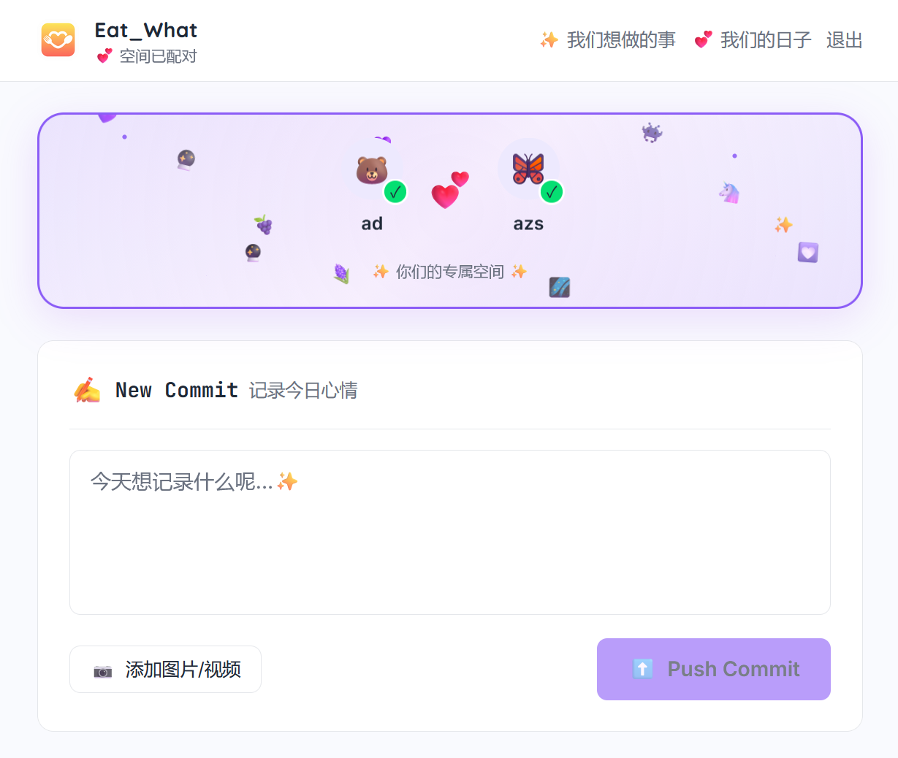
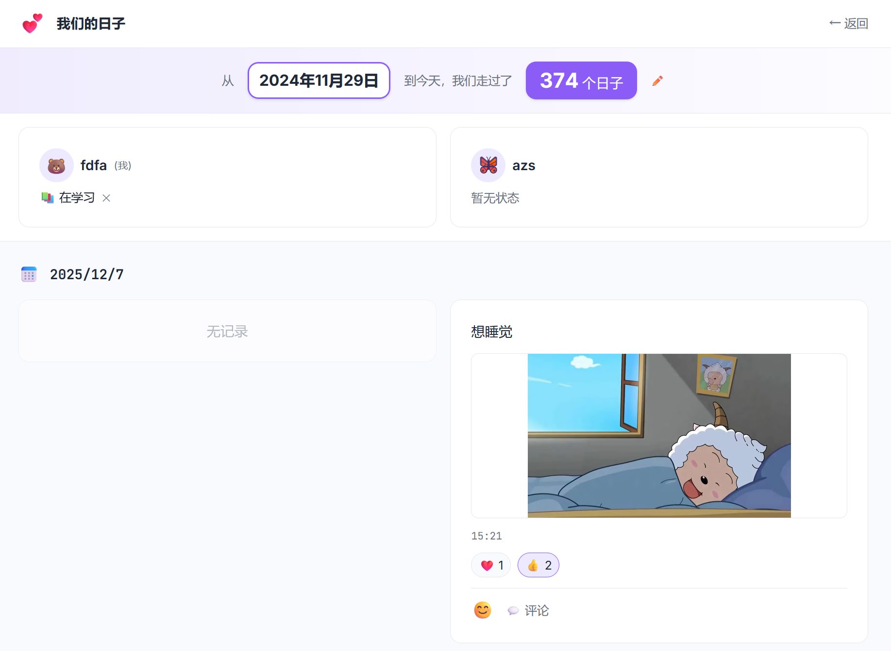
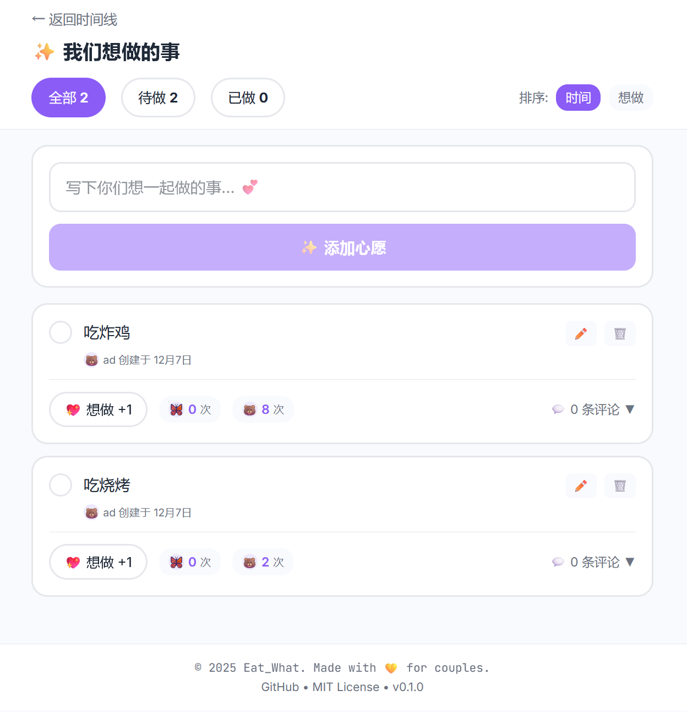

<p align="center">
  
</p>

<h1 align="center">🍽️ Eat_What</h1>

<p align="center">
  <strong>我们的日记</strong> - 每天一条，记录专属于我们的时光 💕
</p>

<p align="center">
  <a href="https://eat-what.fun">🌐 在线访问</a> •
  <a href="#-功能展示">📸 功能展示</a> •
  <a href="#-快速开始">🚀 快速开始</a> •
  <a href="#-技术栈">🛠️ 技术栈</a>
</p>

<p align="center">
  
  
  
  
</p>

---

## 📸 功能展示

<table>
  <tr>
    <td align="center" width="50%">
      
      <br />
      <strong>💬 时间线</strong>
      <br />
      <sub>情侣专属对话空间，每日一记</sub>
    </td>
    <td align="center" width="50%">
      
      <br />
      <strong>💕 情侣卡片</strong>
      <br />
      <sub>浪漫主题动画，显示双方状态</sub>
    </td>
  </tr>
  <tr>
    <td align="center" width="50%">
      
      <br />
      <strong>📅 我们的日子</strong>
      <br />
      <sub>纪念日计数，回顾美好时光</sub>
    </td>
    <td align="center" width="50%">
      
      <br />
      <strong>✨ 我们想做的事</strong>
      <br />
      <sub>共享心愿清单，投票与评论</sub>
    </td>
  </tr>
</table>

---

## ✨ 核心功能

### 💑 情侣绑定
- 🔐 使用共同「口令」创建专属空间
- 👥 每个空间最多绑定两人
- 🎭 无需注册，凭口令 + 爱称即可登录
- 📧 **邮箱验证**：首次登录需绑定邮箱，增强账户安全

### 📝 每日一记
- ⏰ 时间胶囊机制，以「天」为维度
- 📌 每人每天仅限一条动态（增加仪式感）
- 📷 支持文本、图片、视频

### 🎨 主题定制
- 🌈 6 种主题配色（黄/粉/蓝/紫/绿/橙）
- 💫 CoupleCard 动画随主题变化
- 🎯 主题自动保存，全局应用

### 👤 个性化资料
- 🎀 首次登录引导设置性别、爱称、头像
- 🖼️ 支持上传自定义头像或选择 Emoji
- 💭 个人状态展示

### ✨ 我们想做的事
- 📋 共享心愿清单
- ✅ 待做/已做分类筛选
- 💖 无限次「想做」投票
- 💬 嵌套评论（可折叠）
- 🔢 按投票数或时间排序
- 📥 **一键批量导入**（粘贴文本或选择预设模板）

### 📸 我们的日子
- 🖼️ 日记画廊视图
- 📆 纪念日计数器
- 📚 照片回顾

### ☁️ 云端存储
- 📤 图片/视频自动上传至 Cloudinary
- 🔄 自动压缩优化，节省空间
- 🌐 全球 CDN 加速访问

### 📱 移动端适配
- 📱 响应式设计，支持各种屏幕尺寸
- 👆 触摸友好的大按钮区域
- 📱 iPhone 刘海屏安全区适配

### 📬 邮件通知
- 💕 伴侣发布新日记时收到邮件提醒
- 💬 伴侣评论你的日记时收到通知
- ✨ 伴侣添加新心愿时收到提醒

---

## �🛠️ 技术栈

| 分类 | 技术 |
|:----:|:-----|
| **框架** | Next.js 16 (App Router) |
| **语言** | TypeScript 5 |
| **样式** | Tailwind CSS |
| **数据库** | Supabase PostgreSQL |
| **ORM** | Prisma 7 |
| **认证** | JWT (jose) |
| **存储** | Cloudinary (图片/视频云存储) |
| **部署** | Zeabur |

---

## 🚀 快速开始

### 1️⃣ 克隆项目
```bash
git clone https://github.com/xyzxyq/Eat-What.git
cd Eat-What
```

### 2️⃣ 安装依赖
```bash
npm install
```

### 3️⃣ 配置环境变量
复制 `.env.example` 为 `.env`：
```env
DATABASE_URL="你的 Supabase 连接字符串"
DIRECT_URL="你的 Supabase 直接连接"
JWT_SECRET="随机安全字符串"

# Cloudinary (图片云存储)
CLOUDINARY_CLOUD_NAME="你的 Cloud Name"
CLOUDINARY_API_KEY="你的 API Key"
CLOUDINARY_API_SECRET="你的 API Secret"

# Resend (邮件服务)
RESEND_API_KEY="你的 Resend API Key"
EMAIL_FROM="Eat_What <noreply@yourdomain.com>"
```

> 💡 Cloudinary 免费套餐提供 25GB 存储 + 25GB 带宽/月  
> 💡 Resend 免费套餐提供 100封邮件/天

### 4️⃣ 初始化数据库
```bash
npx prisma generate
npx prisma db push
```

### 5️⃣ 启动开发服务器
```bash
npm run dev
```

访问 [http://localhost:3000](http://localhost:3000) 开始使用 🎉

---

## 📁 项目结构

```
src/
├── app/
│   ├── api/                  # API 路由
│   │   ├── auth/login/       # 登录
│   │   ├── moments/          # 日记 CRUD
│   │   ├── wishes/           # 心愿清单
│   │   ├── space/            # 空间设置
│   │   ├── user/             # 用户资料
│   │   └── upload/           # 文件上传
│   ├── timeline/             # 时间线页面
│   ├── gallery/              # 画廊页面
│   ├── wishes/               # 心愿页面
│   └── page.tsx              # 登录页
├── components/
│   ├── CoupleCard.tsx        # 情侣卡片
│   ├── WishCard.tsx          # 心愿卡片
│   ├── ThemeSelector.tsx     # 主题选择
│   ├── OnboardingModal.tsx   # 新用户引导
│   └── ...
├── lib/
│   ├── prisma.ts             # 数据库连接
│   └── auth.ts               # JWT 认证
└── prisma/
    └── schema.prisma         # 数据模型
```

---

## 📄 开源协议

本项目采用 [MIT License](LICENSE) 开源协议。

---

<p align="center">
  Made with 💛 for couples
  <br />
  <sub>© 2024 Eat_What</sub>
</p>
